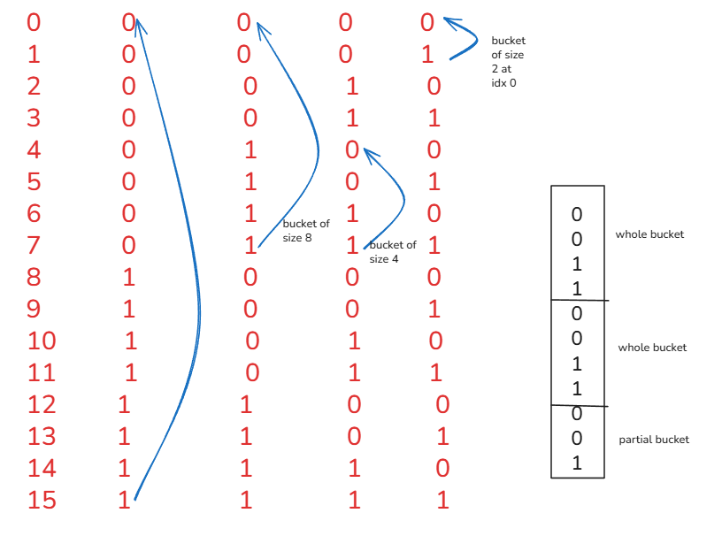

---
title: Application 1
---  
We take a broader look at the Bitwise Contribution Property.  

Consider the following:  
Find the number of set bits from 0 to n.  
**Solution:** We can see that at every bit position, we get buckets of bits that repeat with a period of `2^(i+1)` where i is the bit position. For any bit i, we can say that the number of whole buckets would be `(N+1 / 2^(i+1))` with each bucket having `2^i` set bits, and we also can have a partial bucket of the size `(N+1)%(2^(i+1))`. Now this partial bucket can be all 0s, all 1s or even a mix. We know that in our bucket the first halve are 0s and the second 1s, now if we reduce `(N+1)%(2^(i+1))` by `2^i`, we'll either get a positive number that gives us the number of 1s or a negative number telling there are no ones, or zero telling the partial bucket has exactly `2^i` 0s.  
  
   
```cpp
using lli = long long;
lli setbits(lli x){
    lli sum = 0LL;
    for(int i = 0; i < 60;i++){
        lli blocks = (x+1)/(1LL<<(i+1));
        lli left = (x+1)%(1LL<<(i+1));
        
        sum += blocks*(1LL<<i) + max(left-(1LL<<i), 0ll);
    }return sum;
}
```
