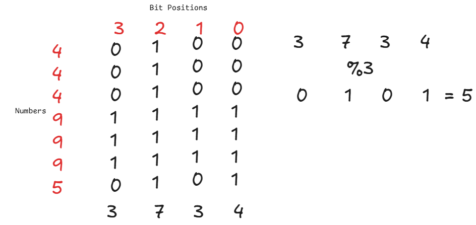
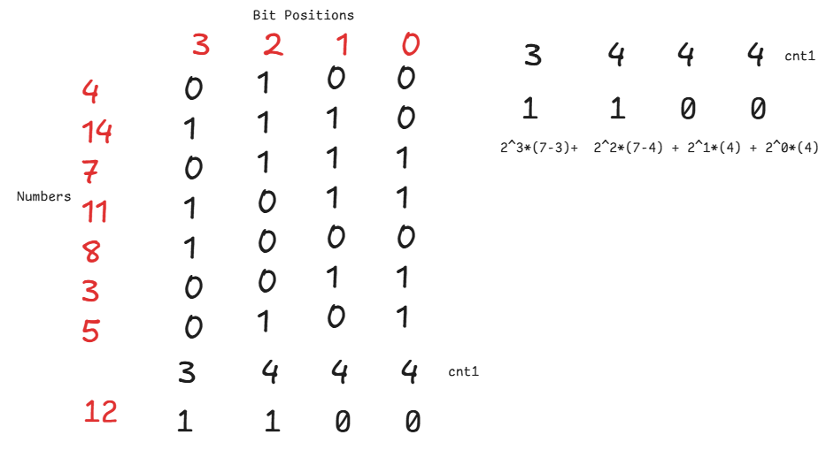

1. Given an array where each number appears twice except one number, find the number that appears only once.  
```cpp
/***
xor over all nums,the answer is the exception
***/
int ans = 0;
for(auto &num: nums){
    ans^=num;
}
cout << ans;
```  
  
2. Given an array where each number appears thrice except one number, find the number that appears only once.
```cpp
int ans = 0;
for(int i = 0; i < 31;i++){
    int cnt = 0;
    for(auto &num: nums){
        cnt+= (((num & (1LL<<i)))1:0);
    }
    if(cnt%3){
        ans|= (1LL<<i);
    }
}return ans;
/***
When we have 3p + 1 numbers, we can be sure that the total bits at each position
would be some 3k + 1/0, with the k coming from numbers in counts of 3 whose ith bit is set
and 1/0 coming from the exception according to if its i-th bit is set or not, now if its set,
we set that bit in our answer consider the array {4,4,4,9,9,9,5}
***/
```  
  
3. Given an array of size N, and Q queries of two types, `? i x `and `! x`, where: `? i x` replaces arr[i] with x and `! x` gives the `summation of all arr[i]^x` over the whole array. Assume `N,Q <= 1e5`(basically you can't do it it using brute force as the tc will exceed limits).  
```cpp
int n = nums.size();
//store either counts of zeroes or counts of ones
int cnt1[32] = {};
for(auto &num : nums){
    for(int i = 0 ; i < 32; i++){
        if(num & (1LL<< i)){
            cnt1[i]++;
        }
    }
}

while(q--){
    cin >> c;
    if( c == '?'){
        cin >> idx >> x;
        for(int i = 0; i < 32;i++){
            if(nums[idx] & (1LL<<i)){
                cnt1[i]--;
            }//remove nums[idx]'s contribution to ith bit
        }
        for(int i = 0; i < 32;i++){
            if(x & (1LL<<i)){
                cnt1[i]++;
            }//add x's contribution to ith bit
        }
    }else{
        cin >> x;
        int ans = 0;
        for(int i  = 0 ; i < 32;i++){
            if(x & (1LL<< i)){
                ans += (n-cnt1[i])* (1LL << i);
            }else{
                ans += cnt1[i]*(1LL << i);
            }
        }
    }
}//Hint to understand better take the array to have only 1/0s and x to be either 1 or 0.
```  
In the final answer at every bit of the answer, if x has the i-th bit set only the numbers whose i-th bit is 0 will contribute to the sum and if x's i-th bit is not set only numbers whose i-th bit is not set will contribute to the answer. We can store the numbers of 1s and number of 0s at each place(or store any one of them as the other would be N - that), and the contribution at i-th bit would be `(1LL << i)*(cnt0)` if x's i-th bit is set or `(1LL << i)*(cnt1)` if x's i-th bit is not set.  

