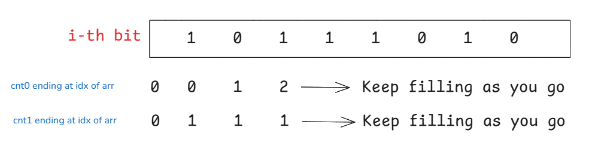

---
title: Subarray XOR sum
---  
Given an array of integers find xor of all elements of all subarrays.  

```cpp
void solve(){
    cin >> n;
    for(int i = 0; i < n; i++){
        cin >> arr[i];
    }

    long long ans = 0;

    for(int i = 0; i < 31; i++){
        long long contri = 0;
        long long cnt0 = 0;
        long long cnt1 = 0;

        for(int j = 0; j < n; j++){
            if(arr[j] & (1 << i)){
                contri += 1 + cnt0;
                long long temp = cnt0;
                cnt0 = cnt1;
                cnt1 = 1 + temp;
            } else {
                contri += cnt1;
                cnt0 += 1;
            }
        }

        ans += contri * (1LL << i);
    }

    cout << ans;

}
```  
  


This algorithm calculates the sum of the XOR-sums of all possible subarrays by computing the contribution of each bit position independently, using the fact that bits do not interact or carry over under the XOR operation. For each bit position i, the variables `cnt0` and `cnt1` track the number of subarrays ending at the previous index with a running XOR of 0 or 1 at that bit, while `contri` accumulates the total number of valid subarrays processed so far. When the current element `arr[j]` has bit i set, it flips the XOR parity of all previous subarrays and introduces a new single-element subarray with bit 1, meaning `contri` increases by `1 + cnt0`, and the counters swap values simultaneously using a temporary variable so that the new `cnt1` becomes `old cnt0 + 1`. Conversely, when `arr[j]` has bit i unset, the running parities remain unchanged, so `contri` simply increases by `cnt1` while `cnt0` increments by 1 to include the new single-element subarray. Finally, the total contribution of the current bit position is scaled by 2^i via `ans += contri * (1LL << i)`, completing the solution in O(N * 31) time and O(1) extra space using `long long` data types to safely prevent 32-bit integer overflow.


