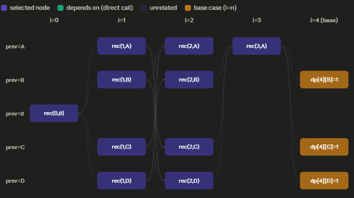

When the states of a recursion are made by making choices as to take/not take an element of the available data structure and try to optimize/count a related value, it most probably than not can be solved with `Form 1`. It can be noted that if the problem statement, say `f(0...N)` is what is to be computed, the DP definition in this case can be made using `f(i...N)`, along with extra constraints like `rec(i,...)` from the question itself. It's like saying if the problem can be solved `i...N` it can also be solved for `0...N`. This gets clearer as we look at the example below.  
Consider the string **S** = "??A?B???D??C??A???", assume constraints for the size of the string such that it can be solved under 1 second.
1. Find the number of ways to fill the '?'s such that no two adjacent positions have the same letter,using only letters `A/B/C/D`.
2. If the string is circular, solve for the above bit.
3. Print the lexicographically smallest string for the above bit.
4. Print all the solutions for the 2nd bit.  
  
**Solving the first bit:**
The form is obvious, so we move to the second step of deciding the definition of our recursion.  
Let rec(i,prev) be the number of ways to fill the string from i...N with prev being the (i-1)th letter of the string. At ith position, the element can be either a letter or '?'. If the ith position is a letter, it moves forward only if prev != ith letter, else it returns 0. If the ith position is '?', there are 3 choices to be made, i.e. all characters except the prev.The code below makes it much more clearer: 
```cpp
int dp[100100][4];
memset(dp, -1, sizeof(dp));
int n = s.size();
int rec(int i, int prev){

    if(i == n){//if we're reaching the end safely we have a valid string
        return 1;
    }

    if(prev != -1 && dp[i][prev]!= -1)return dp[i][prev];

    int ans = 0;
    if(s[i] == '?'){//check curr element if it needs replacing
        for(int ch = 0; ch < 4;ch++){
            if(ch == prev)continue;
            ans+= rec(i+1, ch);
        }
    }else{//check if current element is colliding with prev
        if(s[i] == prev)return 0;
        else ans = rec(i+1, s[i]-'A');
    }

    if(prev != -1)dp[i][prev] = ans;
    return ans;

}
```  
Iteratively:
```cpp
int dp[100100][4];
memset(dp, 0,sizeof(dp));
int n = s.size();
for(int ch = 0; ch < 4;ch++){
    dp[n][ch] = 1;
}
for(int i = n-1; i>= 1;i--){
    for(int prev = 0 ; prev <4;prev++){
        int ans = 0;
        if(s[i]=='?'){
            for(int ch = 0; ch<4;ch++){
                if(ch == prev)continue;
                ans+= dp[i+1][ch];
            }
        }else{
            if(prev != s[i]-'A'){
                ans+= dp[i+1][s[i]-'A'];
            }
        }dp[i][prev] = ans;
    }
}

int ans = 0;
if(s[0]=='?'){
    for(int ch = 0; ch < 4;ch++){
        ans += dp[1][ch];
    }
}else{
    ans = dp[1][s[0]-'A'];
}
```  
The above iterative code looks more or less like this, computing only nodes that are needed:  

  
**Solving the second bit:** The only difference here as compared to the previous bit is that we'd like to ensure that once our string is done `i==n`, the first letter `s[0]` and the prev `i==n-1` aren't equal. Adding a new restriction adds a new state variable to our already existing state.  
```cpp
int dp[100100][4][4];
memset(dp, -1, sizeof(dp));
int n = s.size();
int rec(int i, int prev, int first){
    if(i == n){
        if(prev == first && n!= 1)return 0;
        return 1;
    }
    if(first != -1 && prev != -1 && dp[i][prev][first]!= -1)return dp[i][prev][first];
    int ans = 0;
    if(i == 0){
        if(s[i] == '?'){
            for(int ch = 0; ch < 4;ch++){
                if(ch == prev)continue;
                ans += rec(i+1, ch, ch);
            }
        }else{
            
            ans += rec(i+1, s[i]-'A',s[i]-'A');
        }
    }else{
        if(s[i] == '?'){
            for(int ch = 0; ch < 4;ch++){
                if(ch == prev)continue;
                ans += rec(i+1, ch, first);
            }
        }else{
            if(s[i]-'A' == prev)return 0;
            ans += rec(i+1, s[i]-'A',first);
        }
    }

    if(prev != -1 && first != -1){
        dp[i][prev][first] = ans;
    }
    return ans;
}//Try writing the iterative style code for the same
```  
**Solving the third bit:** Using the previously computed dp-array, we go to a state and check lexicographically for all values that it can take `(check if dp(ith takes value) > 0)` and the first time we get a positive dp-value, we add that element to our auxillary string and continue, like say we're at a '?' and we see that out of A/B/C/D, `dp[i+1,'A'] = 0`, and others arent we can say that the lexicographically smallest string will definitely have 'B' as the ith element. Extend the logic to all(first doesnt matter here).
```cpp
string aux = "";
void generate(int i, int prev, int first){
    if(i == n)return;
    if(i==0){
        if(s[i]=='?'){
            for(int ch = 0; ch < 4;ch++){
            if(ch == prev)continue;
            if(rec(i+1, ch, ch)){
                aux+= (ch+'A');
                generate(i+1,ch,ch);
                return;
            }
         }
        }else{
            if(rec(i+1, s[i]-'A',s[i]-'A')){
                aux+=s[i];
                generate(i+1, s[i]-'A', s[i]-'A');
                return;
            }
        }
    }else {
        if(s[i]=='?'){
            for(int ch = 0; ch < 4;ch++){
            if(ch == prev)continue;
            if(rec(i+1, ch, first)){
                aux+= (ch+'A');
                generate(i+1,ch,first);
                return;
            }
         }
        }else{
            if(rec(i+1, s[i]-'A',first)){
                aux+=s[i];
                generate(i+1, s[i]-'A', first);
                return;
            }
        }
    }
}//aux gives the lexicographically smallest string
```


