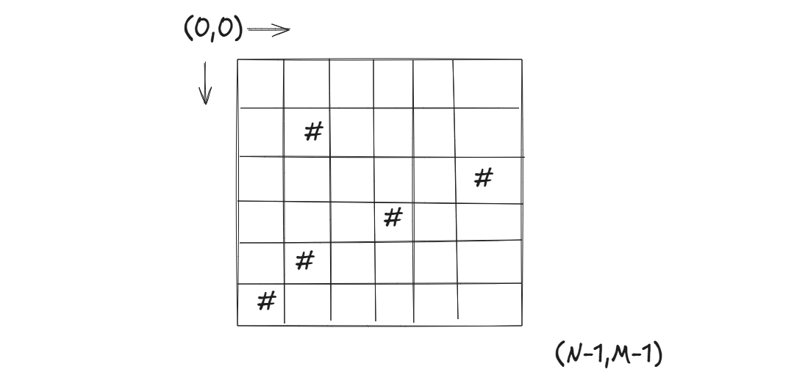

Given a NxM grid, with walls denoted by '#', find the number of possible ways to travel from (0,0) to (N-1, M-1). If this were a shortest path finding problem, bfs could have easily solved it using the least time, however here we're asked to count the paths. Assume that the only possible moves are down, and right.  
  
  
**Solution:** The DP state can be defined as, DP(i,j) = number of paths starting at (0,0) and ending at (i,j). The only paths that can converge at (i,j) are from (i-1,j) and (i,j-1) if they exist. This gives us the state transition, i.e. DP(i,j) = DP(i-1,j) + DP(i, j-1), if they exist and if they're not walls.  TC is O(N*M).  
```cpp
int n,m;
cin >> n;
vector<string>arr;
arr.resize(n);
for(int i = 0; i < n;i++)cin >> arr[i];//take inputs
m = arr[0].size(); 

int dp[1010][1010];
memset(dp, 0, sizeof(dp));

for(int i = 0; i < n;i++){
    for(int j = 0; j <m;j++){
        if(i == 0 && j ==0){
            dp[i][j] = (arr[0][0] == '#') ? 0 : 1;
        }
        else if(arr[i][j] == '#'){
            dp[i][j] = 0;
        }else{
            dp[i][j] = ((i-1)>=0 ?dp[i-1][j]:0) + ((j-1)>=0?dp[i][j-1]:0);
        }
    }
}

int ans = dp[n-1][m-1];
```  
Recursively:  
```cpp
int rec(int i, int j){
    if(arr[i][j] == '#')return 0;
    if(i == 0 && j == 0){
        return ((arr[0][0] == '#') ? 0 : 1);
    }
    int ans = 0;
    if(i-1>= 0){
        ans += rec(i-1,j);
    }
    if(j-1>= 0){
        ans += rec(i,j-1);
    }
    return dp[i][j] = ans;
}
```  
## Follow-up Questions: 
1. Assume that you're given a grid of values assigned to each cell in the array, assuming you still start at (0,0) and end at (n-1,m-1), give the maximum sum of values you can obtain on your traversal.  
2. Given a grid of 1s and 0s fine the area of the maximum square containing only 1s.  
3. Given a grid of positive and negative numbers, a player starts from the cell (0,0) and optimally travels to (n-1,m-1) adding/removing health at cell according to the value present. Find the minimum health he needs to start with before entering cell (0,0). 

**Solution 1:** `DP(i,j) `= Max value accumumlated (0,0) through (i,j). Transition would be `DP(i,j) = max(v[i-1][j] + DP(i-1,j), v[i][j-1]+DP(i,j-1))` if the cells exist.  
```cpp
int n,m; //assume n,m have been initialized and set
int val[1010][1010];//assume values have been filled
int dp[1010][1010];
memset(dp, 0,sizeof(dp));

for(int i = 0; i < n;i++){
    for(int j = 0; j < m;j++){
        if(i==0 && j == 0){
            dp[i][j] = val[i][j];
        }else{
            dp[i][j] = max((i-1)>=0?dp[i-1][j]:0, (j-1)>=0?dp[i][j-1]:0);
        }
    }
}
int ans = dp[n-1][m-1];
```  
**Solution 2:** `DP(i,j)` = length of the maximum square grid ending at `(i,j)`. Transition: `DP(i,j) = min(DP(i-1,j-1), DP(i-1,j), DP(i,j-1)) + 1` if all three neighbors exist and are non-zero.
```cpp
int n,m;
int arr[1010][1010];
int dp[1010][1010];
memset(dp, 0, sizeof(dp));
int ans = 0;
for(int i = 0; i < n;i++){
    for(int j = 0; j < m;j++){
        if(arr[i][j] == 0) continue;
        if(i == 0 || j == 0){
            dp[i][j] = 1;
        }else{
            dp[i][j] = min({dp[i-1][j-1], dp[i-1][j], dp[i][j-1]}) + 1;
        }
        ans = max(dp[i][j], ans);
    }
}
```  
**Note on Form Classification:** This problem is classified under Form 2 as the subproblem is defined as the optimal solution ending at `(i,j)`, building up towards `(n-1,m-1)`. However grid problems in general sit on the boundary between Form 2 and Form 3. The key distinction is — Form 3 involves two truly independent sequences where both indices carry meaningful separate information (like two strings in LCS), whereas here `i` and `j` together just describe a position in a single forward traversal (only down/right moves). Since both indices are forced in one direction and the grid is essentially a single path-finding structure, it leans Form 2. That said, the same problem could be reframed as Form 3 depending on how you define your subproblem — what matters more is that you recognize the transition pattern and arrive at the correct recurrence.  

**Solution 3: **  
Let DP(i,j) denote the minimum health needed before (0,0) to pass from (0,0) to (i,j) without dying. Now we've arrived at Node(i,j) from either (i-1,j) or (i,j-1), and if (i,j) is a positive health then coming into cell (i,j) player won't die, but if its negative, the minimum health at start needs to be nudged up by the abs value of that cell so that he can pass that cell. So DP(i,j) = min(DP(i-1,j), DP(i,j-1)) + abs(min(),arr[i][j]).  
```cpp  
int arr[1010][1010];
int dp[1010][1010];
for(int i = 0;i <n;i++){
    for(int j = 0; j < m;j++){
        if(i == 0 && j == 0){
            if(arr[0][0] > 0)dp[0][0] = 1;
            else dp[0][0] = abs(arr[0][0]) + 1;
        }else{
            if(arr[i][j] > 0)dp[i][j] = min((i-1)>= 0?dp[i-1][j]:0, (j-1)>=0?dp[i][j-1]:0);
            else dp[i][j] = min((i-1)>= 0?dp[i-1][j]:0, (j-1)>=0?dp[i][j-1]:0) + abs(arr[i][j]) + 1;
        }
    }
}

int ans = dp[n-1][m-1];
/***
Verify if this approach is correct or wrong
***/
```  
Let DP(i,j) be the health needed before entering (i,j) to successfully reach (n-1,m-1). Let power needed before entering the next nodes be DP(i+1,j) and DP(i,j+1), so basically after leaving the (i,j)th cell we atleast need to have enough to go through the minimum of both the next cells, so DP(i,j) + arr[i][j] >= min(DP(i+1,j), DP(i,j+1)). This gives us DP(i,j) >= min(DP(i+1,j), DP(i,j+1)) - arr[i][j], if the RHS is negative, it means that arr[i][j] is sufficiently large for the least of the next two nodes, so we only need to be alive before entering so DP(i,j) = max(1, min(DP(i+1,j), DP(i,j+1)) - arr[i][j]), the base case being dp[0][0] = max(1, 1- arr[i][j]) O(N*M), can also binary search on all powers possible and that will be O(N*M*log r).  
```cpp
int dp[1010][1010];
dp[n-1][m-1] = max(1, 1 - arr[n-1][m-1]);
for(int j = m-2; j >= 0; j--)
    dp[n-1][j] = max(1, dp[n-1][j+1] - arr[n-1][j]);
for(int i = n-2; i >= 0; i--)
    dp[i][m-1] = max(1, dp[i+1][m-1] - arr[i][m-1]);
for(int i = n-2; i >= 0; i--){
    for(int j = m-2; j >= 0; j--){
        int best = min(dp[i+1][j], dp[i][j+1]);
        dp[i][j] = max(1, best - arr[i][j]);
    }
}

int ans = dp[0][0];
```