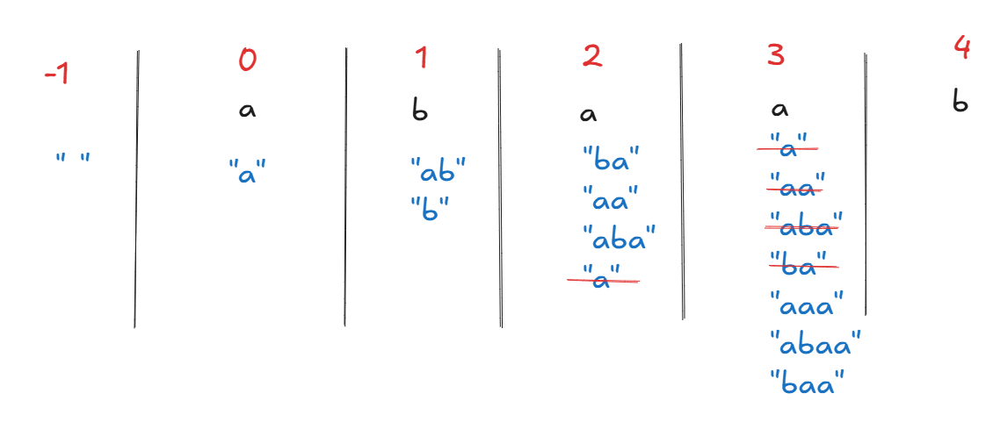

Given a string s = "abaab", find the total number of distinct substrings.

**Solution:**  
This question can be solved using brute force techniques as well, but we're interested in seeing if DP can optimize it.  
We define `DP(i)` as the number of new substrings generated using the character `s[i]` that weren't there before. We'll see in a bit how this helps.



As we can see in the image above, at index -1 we have an empty string. As we get to index 0, our `i`th element gets appended to the previously available strings to make newer ones. Since we don't have any strings yet, the element appends and gives us a new string `"a"`. At index 1, the same thing repeats and we get new strings `["b", "ab"]`. At index 2, the strings being made are `["a", "aa", "ba", "aba"]`, but `"a"` has already been made so we discard it. At index 3, the strings generated are `["a", "aa", "aba", "ba", "aaa", "abab", "baa"]`, but only the last 4 are new.

Generally speaking, at every index `i`, `DP(i)` starts as the number of previously made strings, but many might be duplicates so we need to remove their contribution. To do that, we check at what position our current element last appeared — call it `j`. So `DP(i) = prefix[i-1] - prefix[j-1]`, where `prefix` tracks the cumulative count of strings made so far.

TC: `O(N)`

```cpp
/***
String index: -1  0  1  2  3  4
Prefix idx  :  0  1  2  3  4  5
DP idx      :  0  1  2  3  4  5
***/
int n = s.size();
int prefix[1010]; // total strings till index i
int dp[1010];     // total new strings made at index i
int last_occ[26];
memset(prefix, 0, sizeof(prefix));
memset(dp, 0, sizeof(dp));
memset(last_occ, -1, sizeof(last_occ));

prefix[0] = 1; // sentinel: represents the empty string (base for counting)
dp[0] = 1;
last_occ[s[0] - 'a'] = 0;

for(int i = 1; i < (int)s.size() + 1; i++){
    dp[i] = prefix[i-1];
    if(last_occ[s[i-1] - 'a'] != -1){
        dp[i] -= prefix[last_occ[s[i-1] - 'a']];
    }
    last_occ[s[i-1] - 'a'] = i;
    prefix[i] = prefix[i-1] + dp[i];
}

int ans = prefix[n] - 1; // exclude the empty substring
```